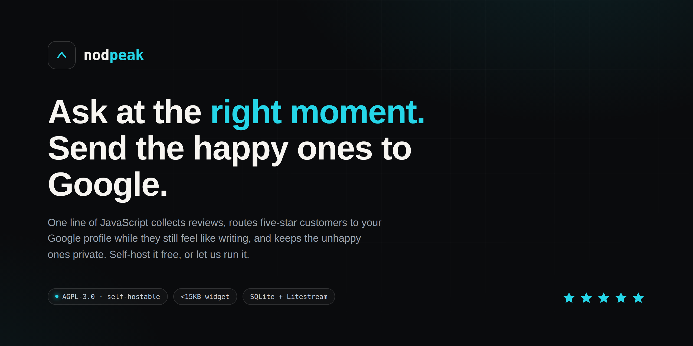
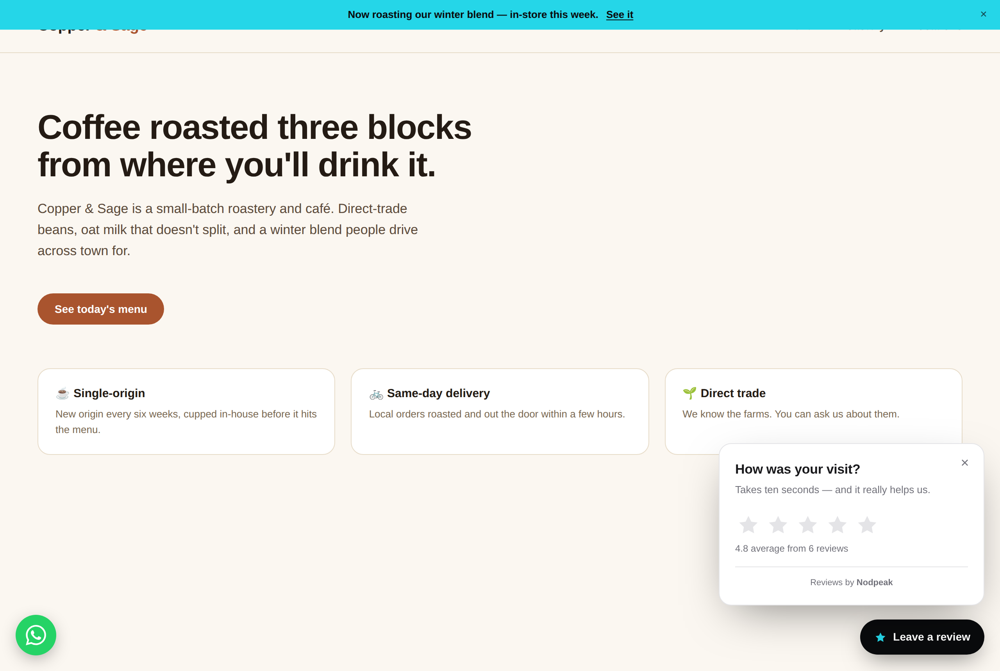
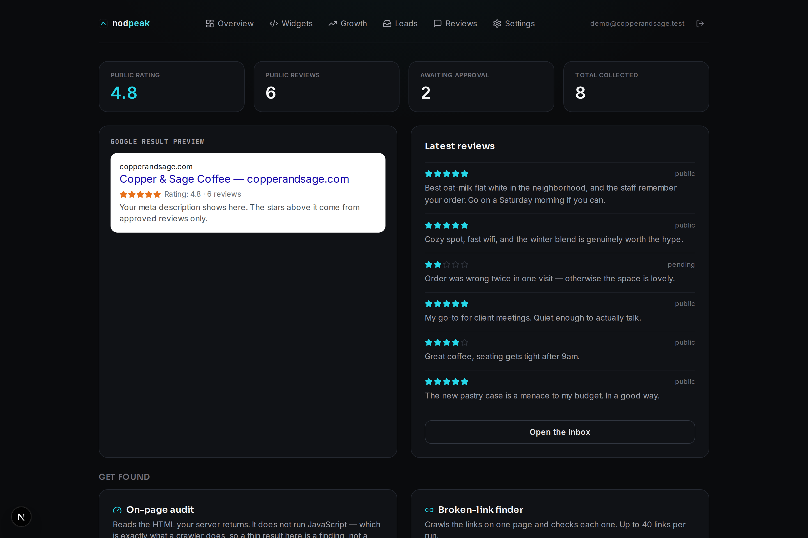
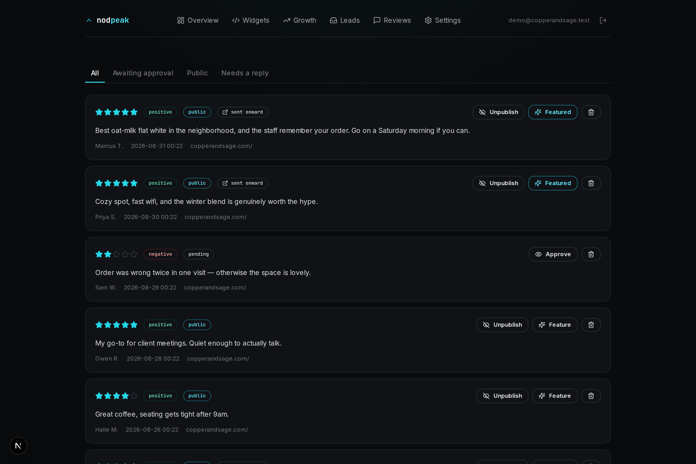
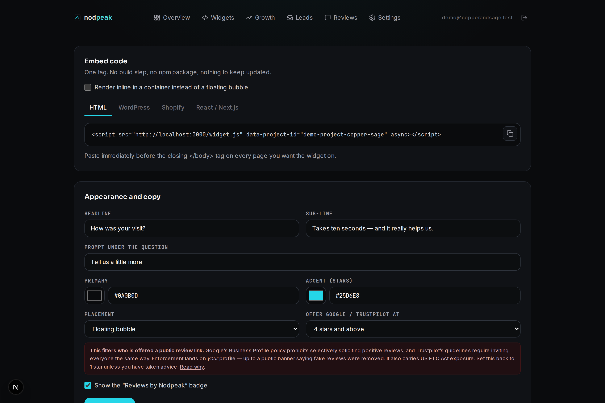

<div align="center">



**Ask at the right moment. Send the happy ones to Google.**

One line of JavaScript collects reviews on your site, hands five-star customers a link
to your Google profile while they still feel like writing, and routes the unhappy ones
to a private form that reaches you instead of the internet.

Self-host it on a free ARM box, or let us run it for $15/mo.

[](https://github.com/nodpeakapp/nodpeak/actions/workflows/ci.yml)
[](https://www.gnu.org/licenses/agpl-3.0)


</div>

---

## See it working

<table>
<tr>
<td width="50%">

**The widget, on a customer's site**


</td>
<td width="50%">

**Your dashboard**


</td>
</tr>
<tr>
<td width="50%">

**Moderation — default-deny**


</td>
<td width="50%">

**Embed code, generated for you**


</td>
</tr>
</table>

---

## What it actually does

```
                 ★★★★★ ─────────► "What did you love most?" ─────► Post on Google / Trustpilot
   Customer ──►  rating                                             (the review that ranks)
                 ★★☆☆☆ ─────────► "How can we improve?"    ─────► Private inbox, owner only
                                                                    (the one you can fix)
```

Three things, and it does them without a plugin, a build step, or a monthly seat fee:

1. **Collects reviews** through a shadow-DOM widget that loads in one request and cannot be
   broken by the host page's CSS.
2. **Routes by sentiment** — the star threshold decides who gets *offered* a link onward.
3. **Publishes schema you can defend** — `AggregateRating` JSON-LD built from reviews you
   approved, injected into the host page's `<head>`. Zero approved reviews emits **no markup
   at all**, because a `reviewCount` of 0 is worse than nothing.

### One thing most tools in this category won't tell you

Google does **not** show review rich results for self-serving reviews on `LocalBusiness` or
`Organization` markup — a business publishing ratings about itself, on its own site. That
markup will validate perfectly in Rich Results Test and produce exactly zero stars in search.

So Nodpeak does two things about it:

- It defaults the schema type to `Service`, and the dashboard **warns you** when an audit
  finds `AggregateRating` sitting on an excluded type.
- For local businesses, it puts its effort where the stars actually appear: routing happy
  customers to your **Google Business Profile**, which is what surfaces in the Maps pack.

If a competing product is selling you a validator screenshot as an SEO win, that is what
you are buying.

---

## Quickstart

### Self-host (5 minutes, one command)

```bash
git clone https://github.com/nodpeakapp/nodpeak.git
cd nodpeak
cp .env.example .env
nano .env                 # set DOMAIN, APP_URL, CERTBOT_EMAIL, AUTH_SECRET
sudo ./deploy.sh
```

Deploying to Oracle Cloud's free tier specifically? **[DEPLOY-ORACLE.md](DEPLOY-ORACLE.md)** is
the click-by-click version, including the two separate firewalls Oracle makes you open and the
free-tier limit change that broke most older guides.

`deploy.sh` handles the whole box: system updates, Docker Engine, ports 80/443 through both
`ufw` and the `iptables` INPUT chain that Oracle Cloud images ship locked down, a bootstrap
self-signed cert so nginx can start, then the real Let's Encrypt certificate and a renewal
loop.

Already have Docker and a certificate?

```bash
cp .env.example .env && nano .env
docker compose up -d
```

Generate a real secret before you do anything else:

```bash
openssl rand -base64 48
```

### Local development

```bash
npm install
cp .env.example .env                       # DATABASE_URL=file:./dev.db is fine locally
npm run db:push --workspace=@nodpeak/web
npm run dev
```

Dashboard at `http://localhost:3000`, widget served at `http://localhost:3000/widget.js`.

---

## Self-host vs. managed cloud

|                                | **Self-host** (free, AGPL) | **Managed cloud** ($15/mo) |
| ------------------------------ | -------------------------- | -------------------------- |
| Review collection widget       | ✅ Unlimited                | ✅ Unlimited                |
| Projects / websites            | ✅ Unlimited                | 25                         |
| Reviews stored                 | ✅ Unlimited                | ✅ Unlimited                |
| JSON-LD schema injection       | ✅                          | ✅                          |
| On-page SEO audit              | ✅                          | ✅                          |
| Real Lighthouse mobile scores  | Bring your own PageSpeed key | ✅ Included               |
| Your data lives                | On your box                | On ours (EU or US)         |
| Backups                        | You configure Litestream   | ✅ Continuous to R2         |
| Uptime, patching, TLS renewal  | You                        | Us                         |
| Deliverability for review invites | Your SMTP               | ✅ Warmed pool              |
| Support                        | GitHub issues              | Email, 1 business day      |
| Cost                           | ~$0 on an Oracle Ampere A1 free tier | $15/mo          |

Both run the **same code**. The cloud plan is convenience and someone else's pager — not a
feature gate. If you self-host and hit a wall, that's a bug, not an upsell.

**Hardware reality check:** an Oracle Cloud Ampere A1 Always Free instance — **2 ARM cores and
12 GB of RAM** — runs this with room to spare. SQLite, one Node process, nginx. No Postgres to
babysit, no Redis to forget about.

> Oracle **halved** the Always Free A1 allowance in mid-2026, from 4 OCPU / 24 GB down to
> 2 OCPU / 12 GB, and began disabling over-limit instances in August 2026. Most guides online
> still print the old figure. Stay at or under 2 OCPU / 12 GB *in total across every A1
> instance in your tenancy* — see [Oracle's Always Free resources doc][oci-free]. `DEPLOY-ORACLE.md`
> in this repo walks the whole thing end to end.

[oci-free]: https://docs.oracle.com/en-us/iaas/Content/FreeTier/freetier_topic-Always_Free_Resources.htm

---

## Integration

The widget is one tag. Everything else is configuration in the dashboard.

### Plain HTML

```html
<script src="https://your-install.com/widget.js"
        data-project-id="YOUR_PROJECT_ID" async></script>
```

Paste it immediately before `</body>`.

### Inline instead of a floating bubble

```html
<div id="nodpeak"></div>
<script src="https://your-install.com/widget.js"
        data-project-id="YOUR_PROJECT_ID"
        data-mount="nodpeak" async></script>
```

### WordPress

Child theme `functions.php`:

```php
add_action( 'wp_footer', function () { ?>
    <script src="https://your-install.com/widget.js"
            data-project-id="YOUR_PROJECT_ID" async></script>
<?php }, 20 );
```

No child theme? **Appearance → Widgets → Footer → Custom HTML** and paste the plain snippet.
Works on any theme, survives theme updates, needs no plugin.

### Shopify

**Online Store → Themes → Edit code → `layout/theme.liquid`**, above `</body>`:

```liquid
<script src="https://your-install.com/widget.js"
        data-project-id="YOUR_PROJECT_ID" async></script>
```

For product-level reviews, use one project per product line and swap the `data-project-id`
with a Liquid variable.

### Webflow

**Project Settings → Custom Code → Footer Code**, paste the plain HTML snippet, publish.
Site-wide, no per-page work.

### React / Next.js

```tsx
import Script from "next/script";

export default function Nodpeak() {
  return (
    <Script
      src="https://your-install.com/widget.js"
      data-project-id="YOUR_PROJECT_ID"
      strategy="afterInteractive"
    />
  );
}
```

Plain React (Vite, CRA) — append the tag in an effect and clean it up on unmount:

```tsx
useEffect(() => {
  const s = document.createElement("script");
  s.src = "https://your-install.com/widget.js";
  s.dataset.projectId = "YOUR_PROJECT_ID";
  s.async = true;
  document.body.appendChild(s);
  return () => { s.remove(); };
}, []);
```

### Script attributes

| Attribute         | Required | Purpose                                                        |
| ----------------- | -------- | -------------------------------------------------------------- |
| `data-project-id` | yes      | Which project the reviews belong to.                            |
| `data-mount`      | no       | Element id to render into. Switches bubble → inline card.       |
| `data-api`        | no       | Override the API origin. Only needed behind an unusual proxy.   |

---

## API

Public endpoints are CORS-open by design — the widget calls them from customer domains.

| Method | Path                          | Auth      | Purpose                                              |
| ------ | ----------------------------- | --------- | ---------------------------------------------------- |
| `GET`  | `/api/v1/widget-config/:id`   | none      | Styling, copy, public reviews, pre-built JSON-LD.     |
| `POST` | `/api/v1/feedback`            | none      | Store a review, classify it, return routing decision. |
| `POST` | `/api/v1/seo-audit`           | optional  | Audit a URL. Persists only for a project you own.     |
| `POST` | `/api/webhooks/payment`       | HMAC      | Upgrade/downgrade a user's tier.                      |
| `GET`  | `/api/health`                 | none      | Liveness + database check.                            |

### `POST /api/v1/feedback`

```jsonc
// request
{ "projectId": "clx…", "rating": 5, "comment": "Fixed it same day.",
  "customerName": "Dana", "customerEmail": "dana@example.com",
  "sourceUrl": "https://acmeplumbing.com/contact" }

// response
{ "ok": true, "reviewId": "clx…", "sentiment": "POSITIVE",
  "redirect": { "google": "https://search.google.com/local/writereview?placeid=…",
                "trustpilot": null } }
```

`redirect` is `null` below the configured star threshold. The review is stored either way.

### `POST /api/webhooks/payment`

Sign the **raw request body** with HMAC-SHA256 using `PAYMENT_WEBHOOK_SECRET` and send it as
`x-nodpeak-signature`. Lemon Squeezy, Paddle and generic 2Checkout/Payoneer payload shapes
are normalized in `normalize()` — adding a provider is one `case`.

If `PAYMENT_WEBHOOK_SECRET` is unset the endpoint returns **503**, not 200. A billing webhook
that fails open hands out free upgrades to anyone who can POST.

---

## Security notes

Worth reading before you put this on the internet:

- **SSRF.** `/api/v1/seo-audit` fetches a caller-supplied URL from inside your container.
  Every redirect hop is re-resolved and re-checked against private, loopback, link-local and
  CGNAT ranges — including `169.254.169.254`, the cloud metadata endpoint. Validating only
  the submitted URL and then following redirects is not a guard at all.
- **Moderation is default-deny.** New reviews are `isPublic: false`. Nothing reaches the
  public wall or the schema until you approve it.
- **IPs are hashed**, never stored raw — enough to rate-limit, not enough to be a liability.
- **Timing.** Login returns the same message and comparable timing whether or not the email
  exists, so the form is not a customer-list oracle.
- **Rate limiting is in-process.** Correct for the single container this repo ships. Run more
  than one replica and each keeps its own counters — swap in Redis at that point. Called out
  rather than hidden, because a limiter that silently stops limiting is worse than none.

Found something? Open a security advisory rather than a public issue.

---

## Architecture

```
nodpeak/
├── apps/web/                 Next.js 16 (App Router) — dashboard, API, Prisma
│   ├── prisma/schema.prisma  User · Project · WidgetConfig · Review · SeoAudit
│   └── src/lib/              auth · schema-generator · sentiment · safe-fetch · seo-audit
├── packages/widget/          Vanilla TS embed → apps/web/public/widget.js
├── nginx/default.conf        TLS, gzip, CORS for /widget.js, proxy cache
├── Dockerfile                Multi-stage, linux/arm64 first
├── docker-compose.yml        app · nginx · certbot
└── deploy.sh                 Bare Ubuntu → running HTTPS install
```

**Why SQLite.** One file, no daemon, no connection pool, and Litestream streams it to S3/R2
continuously. The failure mode of a managed Postgres you forgot to pay for is worse than the
failure mode of a file on a volume you back up. Set `LITESTREAM_ENABLED=true` and fill in the
bucket variables.

**Why a 15 KB budget.** The build **fails** if the gzipped widget exceeds it. A review widget
that costs a customer's site 200 ms of Largest Contentful Paint is a net negative for the
thing it claims to improve.

---

## A note on the framework version

The original spec for this build pinned **Next.js 14**. That line is no longer patched — as
of this build even `14.2.35`, the last 14.x release, carries 20+ open high-severity
advisories including SSRF in Server Actions and unauthenticated disclosure of internal
Server Function endpoints. For something whose whole pitch is "self-host this on your own
box", shipping that was not defensible, so the app runs on **Next 16 / React 19** and
`npm audit` is clean. Everything else in the spec is unchanged.

If you fork this and pin an older Next, run `npm audit` before you deploy it anywhere real.

---

## Configuration

Every variable is documented inline in [`.env.example`](.env.example). The ones you must set:

| Variable                  | Why                                                                 |
| ------------------------- | ------------------------------------------------------------------- |
| `APP_URL`                 | Every embed snippet and the JSON-LD `@id` are built from it.         |
| `AUTH_SECRET`             | Signs session cookies. Rotating it signs everyone out.               |
| `DOMAIN`, `CERTBOT_EMAIL` | Used by `deploy.sh` for the certificate.                             |
| `DEPLOYMENT_MODE`         | `selfhost` (no limits, no billing) or `cloud`.                       |
| `ALLOW_REGISTRATION`      | Set `false` on a single-tenant install after you create your account. |

---

## Roadmap

- [ ] Review invite emails (SMTP + a warmed pool on cloud)
- [ ] QR codes and SMS invites for in-person handoffs
- [ ] Per-product projects for Shopify catalogues
- [ ] Response templates for negative feedback
- [ ] Import existing Google reviews for the public wall
- [ ] Redis-backed rate limiting for multi-replica installs

---

## Contributing

Issues and pull requests welcome — see [`CONTRIBUTING.md`](CONTRIBUTING.md) for local setup and
what's in scope. This project follows a [Code of Conduct](CODE_OF_CONDUCT.md). Found a security
issue? Please read [`SECURITY.md`](SECURITY.md) instead of opening a public issue.

## License

[AGPL-3.0](LICENSE). Self-host it, fork it, run an agency on it. If you offer it as a hosted
service, the AGPL asks you to publish your modifications.

---

<div align="center">

Built by [Nouman Sadiq](https://noumansadiq.com)

</div>
